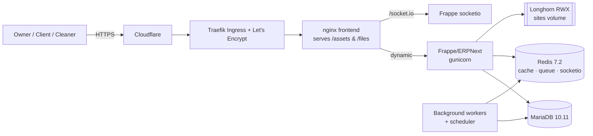

# Easy Maid Service

> Enterprise-grade, ERPNext-based operations platform for a residential & commercial
> cleaning company — leads, quotes, one-time & recurring bookings, crew dispatch,
> invoicing, Stripe payments, payroll, and bookkeeping — with dedicated **Owner**,
> **Client**, and **Cleaner** experiences.

[](https://erpnext.com)
[](https://k3s.io)
[](openspec/)
[](LICENSE)

Easy Maid Service is a single source of truth for running a cleaning business: it turns a
website lead into a quote, a quote into a scheduled (and optionally recurring) booking,
dispatches a crew, tracks the on-site service visit, then invoices and collects payment —
all on a **new, fully isolated** Frappe + ERPNext instance.

> ⚠️ **Isolation guarantee.** This project is 100% isolated in the Kubernetes namespace
> `easymaid`. It **never** reads, modifies, or references the pre-existing Frappe server
> (namespace `frappe`, site `client.trector.com`). See [`AGENTS.md`](AGENTS.md).

---

## Table of contents

- [Highlights](#highlights)
- [Architecture](#architecture)
- [Technology stack](#technology-stack)
- [Repository layout](#repository-layout)
- [Local development](#local-development)
- [Production deployment](#production-deployment)
- [Data model](#data-model)
- [Security & compliance](#security--compliance)
- [Engineering workflow](#engineering-workflow)
- [Project status](#project-status)
- [License](#license)

---

## Highlights

- **End-to-end lifecycle** — lead intake → quote → booking → dispatch → service visit →
  invoice → payment → payroll, without leaving the platform.
- **One-time & recurring visits** — recurrence rules materialize into individual, idempotent
  service visits (unique per booking + date), safe to re-run on a schedule.
- **Role-based portals** — a single Frappe UI (Vue) app renders tailored Owner, Client, and
  Cleaner experiences from the same backend.
- **Stripe hosted checkout** — card data never touches application servers (PCI SAQ-A).
- **Localized** — New Jersey / USD with a configurable NJ sales-tax template (rate editable
  without a code deploy).
- **Policy enforced server-side** — 24-hour minimum cancel/reschedule notice, with an
  Owner/Admin override.
- **Kubernetes-native** — raw, auditable manifests (no Helm), Longhorn storage, Traefik +
  Let's Encrypt TLS, and a dedicated nginx frontend for static assets.
- **Spec-driven delivery** — every capability is defined in OpenSpec before it is built.

## Architecture



Requests enter through Cloudflare and Traefik, terminate TLS, and hit an **nginx frontend**
that serves static assets (`/assets`, `/files`) directly and proxies dynamic traffic to
gunicorn (and `/socket.io` to the realtime service). Frappe persists to MariaDB, uses Redis
for cache/queue/realtime, and stores site data on a shared Longhorn RWX volume. Background
workers and the scheduler run recurring jobs (e.g., materializing recurring visits).

## Technology stack

| Layer | Choice |
| --- | --- |
| Application | Frappe framework + ERPNext (`frappe/erpnext:version-16`) |
| Custom app | `easy_maid` (DocTypes, hooks, fixtures, Vue frontend) |
| Database | MariaDB 10.11 |
| Cache / queue / realtime | Redis 7.2 (three instances) |
| Web serving | nginx frontend + gunicorn (WSGI) + socketio |
| Orchestration | Kubernetes (k3s), raw manifests via Kustomize |
| Storage | Longhorn — sites **RWX**, database **RWO** |
| Ingress / TLS | Traefik, cert resolver `letsencrypt` |
| Payments | Stripe hosted checkout |
| Local dev | Docker Compose |
| Specs | OpenSpec (`openspec validate --all --strict`) |

## Repository layout

| Path | What |
| --- | --- |
| [`openspec/`](openspec/) | Specs & changes — **source of truth for what to build** |
| `openspec/changes/bootstrap-easy-maid-erpnext/` | Foundational change (proposal, design, specs, tasks) |
| [`apps/easy_maid/`](apps/easy_maid/) | Custom Frappe app (DocTypes, hooks, APIs, fixtures, Vue frontend) |
| [`deploy/k8s/easymaid/`](deploy/k8s/easymaid/) | Production Kubernetes manifests (Kustomize) |
| [`deploy/local/`](deploy/local/) | Docker Compose stack for local development |
| [`brand/`](brand/) | Brand assets (logo, favicon, icons) + generator |
| [`scripts/`](scripts/) | Operational & verification scripts |
| [`docs/`](docs/) | Runbooks, including the required [Full Deploy](docs/FULL-DEPLOY.md) workflow |
| [`AGENTS.md`](AGENTS.md) | Build conventions & guardrails |

## Local development

A self-contained Docker Compose stack stands up the whole platform locally (site
`easymaid.localhost`) with MariaDB, the three Redis instances, web/socketio, scheduler, and
workers. The `easy_maid` app source is bind-mounted for live iteration.

```bash
cd deploy/local
cp .env.example .env          # fill in local-only values (never commit .env)
docker compose up -d          # first run creates and seeds the site
# open http://easymaid.localhost
```

See [`deploy/local/README.md`](deploy/local/README.md) for details.

## Production deployment

Production runs on k3s in the isolated `easymaid` namespace, served at
`https://easymaid.trector.com`. Manifests are applied with Kustomize:

```bash
kubectl kustomize deploy/k8s/easymaid        # render & review
kubectl apply -k deploy/k8s/easymaid         # apply
```

Secrets (DB, admin, Stripe, app repo URL) are provided via Kubernetes Secrets and are
**never** committed — see [`deploy/k8s/easymaid/secret.example.yaml`](deploy/k8s/easymaid/secret.example.yaml).
The end-to-end release process is documented in [`docs/FULL-DEPLOY.md`](docs/FULL-DEPLOY.md).

## Data model

Built on native ERPNext (Customer, Address, Item, Sales Order, Subscription, Sales Invoice,
Payment, Payroll) plus three custom DocTypes where ERPNext lacks a native concept:

- **Booking** — customer + address, service item(s), price, a one-time date **or** a
  recurrence rule (frequency/interval/start/end-or-count), optionally linked to a Sales
  Order / Subscription.
- **Service Visit** — links a Booking, a scheduled window, status
  (Scheduled / In Progress / Completed / Cancelled), completion timestamp, and notes.
- **Crew Assignment** — an Employee and role on a Service Visit, with overlap validation.

## Security & compliance

- **Namespace isolation** — no access to the pre-existing `frappe` namespace or its site.
- **No secrets in git** — only `*.example` templates are committed; real values live in
  Kubernetes Secrets / site config. `.env` files are gitignored.
- **PCI SAQ-A** — payments use Stripe hosted checkout; no card data on app servers.
- **Server-side policy enforcement** — cancellation/reschedule rules enforced in the backend,
  not just the UI.
- Report a vulnerability privately via [`SECURITY.md`](SECURITY.md).

## Engineering workflow

1. Read [`AGENTS.md`](AGENTS.md), then the active OpenSpec change.
2. Implement `tasks.md` top-to-bottom — each task has an **Acceptance** check.
3. Keep specs green:

   ```bash
   openspec validate --all --strict
   ```

4. Lint manifests: `yamllint -d relaxed deploy`.
5. Use **Conventional Commits** (`type(scope): subject`) and `type/short-description` branches.
6. Ship via the [Full Deploy](docs/FULL-DEPLOY.md) workflow.

`main` is protected: changes land via pull request, direct pushes and force-pushes are
blocked, and a linear history is enforced.

## Project status

Active development. Production infrastructure is live at `https://easymaid.trector.com`
(stock ERPNext); the `easy_maid` custom app is being rolled out. Track progress in
`openspec/changes/bootstrap-easy-maid-erpnext/tasks.md`.

## License

Proprietary — © Trec-Tor Consulting. All rights reserved. See [`LICENSE`](LICENSE).
